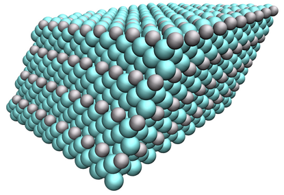

# Stability of binary precipitates in Cu-Ni-Si-Cr alloys investigated through active learning

Publication Date: June 14, 2023

Authors: Ángel Díaz Carral, Xiang Xu, Simon Gravelle, Azade Yazdan Yar, Siegfried Schmauder, Maria Fyta

Materials Chemistry and Physics 2023, XXXX, XXX, XXX-XXX

This folder is associated with [our 2023 publication](https://doi.org/10.1016/j.matchemphys.2023.128053), in which we apply active learning to provide an insight to additional new stable copper alloy.

### Data and script

Data are hosted in the [Github repository of Ángel Díaz Carral](https://github.com/adiazcarral/cunisicr).

