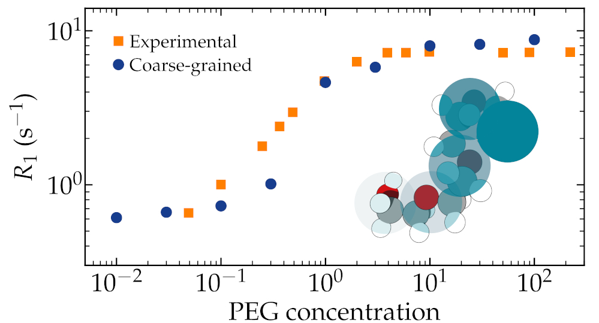

# Assessing the validity of NMR relaxation rates obtained from coarse-grained simulations

Preprint 2023

Authors: Simon Gravelle, David Beyer, Mariano Brito, Alexander Schlaich, and Christian Holm

Publication Date: xxx

This folder is associated with [our 2023 preprint](https://doi.org/10.26434/chemrxiv-2022-f90tv-v3), in which we
test the validity of NMR relaxation rates obtained from coarse-grained simulations using a model PEG-H2O system.

### Data and script

Python, GROMACS, and ESPResSo scripts are hosted in the [DaRUS repository of the university of Stuttgart](https://doi.org/10.18419/darus-3313).

### Backmapping

The [back-mapping/](back-mapping/) folder contains the script used to reconstruct the atomic details from a coarse-grained trajectory file.

### Animation

An [animation/](animation/) of a PEG molecule inspired by [hothello](https://matsci.org/t/open-review/47852) post on the LAMMPS forum. 

