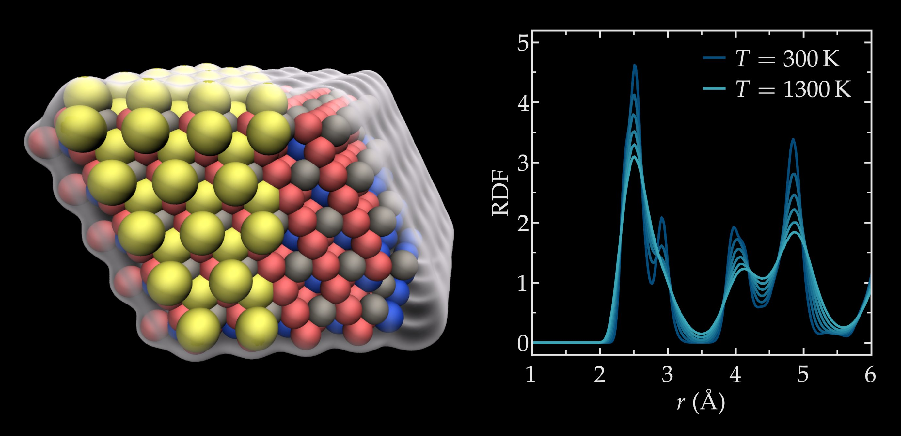

# In silico design and prediction of metastable quaternary phases in Cu-Ni-Si-Cr alloys

Publication Date: 2024

Authors: Ángel Díaz Carral, Simon Gravelle, Maria Fyta

Journal: APL Machine Learning

ArXiv: https://doi.org/10.48550/arXiv.2410.17879

DOI: https://doi.org/10.1063/5.0228936

This folder is associated with our 2024 publication in APL Machine Learning, in which we apply active
learning to provide an insight to a quaternary material: Cu-Ni-Si-Cr alloys.

### Potential

The potential is located within the potential/ folder. It was used with the
2Aug2023 version of LAMMPS that was compiled with the following packged:

- user-mlip
- CLASS2
- EXTRA-DUMP
- EXTRA-FIX
- MANYBODY
- MC
- MOFFF
- MOLECULE
- PHONON
- REAXFF
- RIGID

You can find more information on the MLPI package [here](https://gitlab.com/ashapeev/interface-lammps-mlip-2.git).

### Data and script

For both structures, Cu4NiSi2Cr and tet-CuSiNiCr, three folders are provided:

- topology - initial structure in .asc, .data, .vesta, and .xyz format,
- elastic-modulus - LAMMPS input scripts to measure elastic properties at 0 K,
- NPT - LAMMPS input scripts to perform molecular dynamics in the NPT ensemble.