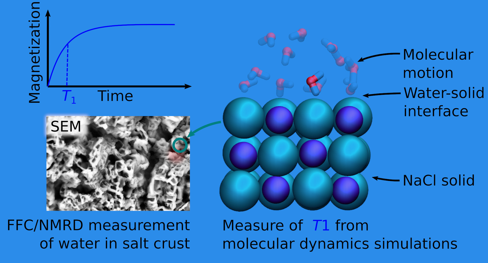
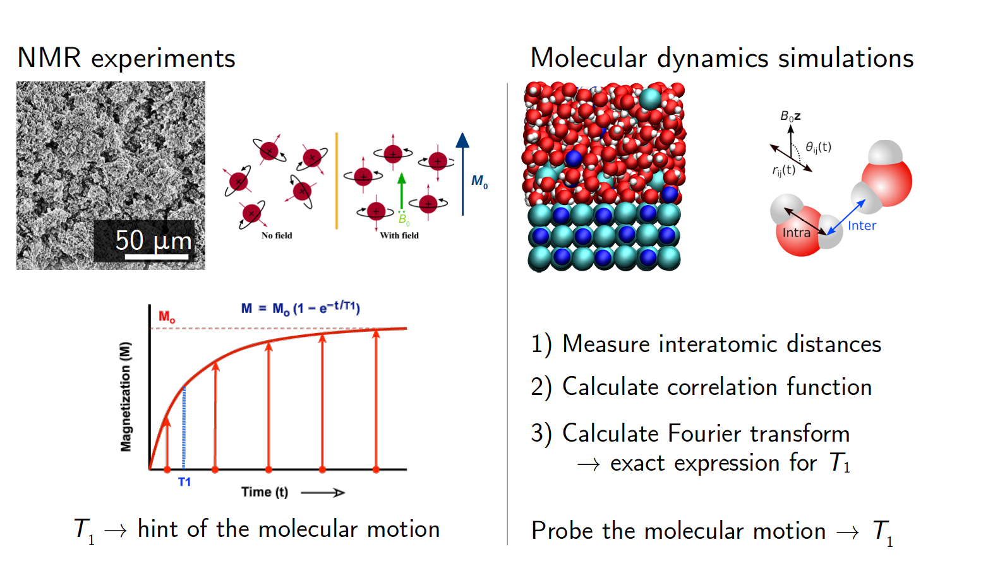

# NMR Investigation of Water in Salt Crusts: Insights from Experiments and Molecular Simulations

Langmuir 2023, XXXX, XXX, XXX-XXX

Authors: Simon Gravelle, Sabina Haber-Pohlmeier, Carlos Mattea, Siegfried Stapf, Christian Holm, and Alexander Schlaich
Publication Date: May 19, 2023

This repository is associated with [our 2023 publication](https://doi.org/10.1021/acs.langmuir.3c00036) in Langmuir, in which we
investigate the properties of water confined withing salt crust using both NMR experiments and molecular dynamics simulations.

### Data and script

Python and GROMACS scripts are hosted in the DaRUS repository of the university of Stuttgart: see here for
[bulk systems](https://doi.org/10.18419/darus-3179), and here for [slit pores](https://doi.org/10.18419/darus-3180).

## In short

### Goals

This page describes the investigation we conducted as part of the SFB 1313, in collaboration 
with the experimental group of Ilmenau (Germany). The goals of the investigation were to:

- **better understand the properties of water confined within salt crusts**, which are disordered porous media made of salt,
- **combine NMR experiments**, which allow for probing the dynamics of water within a porous medium, **with molecular simulations**, a numerical method which allow to resolve the trajectories of water molecules, and their interaction with the salt surface.

### The particularity of salt crusts

When a fluid is in contact with a solid surface, its properties near the solid surface are modified. In general, the fluid viscosity, density, or dielectric permeability are different within a few nanometer distance from the surface, due to the solid-liquid interactions.

In the case were the solid surface is made of salt, as is the case for porous salt crusts, it creates a systems that is really unique, because salt is present within both the fluid, in the form of dissolved ions, and also constitute the solid surface. In addition, the adsorption of ions at the solid surface creates rough and locally charged landscape which in turn impacts the properties of water within the interface layer, as we will see below.

### NMR experiments versus molecular dynamics simulations

Here, both NMR experiments and molecular dynamics simulations were conducted. And although both methods can be used to compare the same quantities, the so-called NMR relaxation time, or *T1*.

In the case of the experiments, we used macroscopic salt crusts, which are porous medium made of salt and containing water. The system is exposed to a large magnetic field, and the typical time the spins of the atoms, here the hydrogen atoms of the water molecules, need to align with the imposed magnetic field is measured. This characteristic time is called *T1*, and is typically of the order of a few seconds for liquid water at ambient temperature. The reason why *T1* is of interest here, is that it depends on the molecular motions of the water molecules within the salt crust, so measuring *T1* is a direct way of probing the rotational and translation motion of the molecules inside the pores. 

For the molecular dynamics (MD) simulations, however, *T1* canno't be measured the same way since atoms are modelled as a simple point with a partial charge, but no spin. So instead of measuring *T1* directly, the opposite route is followed: the molecular motion is probed, and *T1* is calculated. Technically, one has to measure the distance and orientation between all the hydrogen atoms over time, inject those quantities in a correlation function, and then calculate its spectrum using Fourier transform. The complete path and formula is described in the [article](https://doi.org/10.1021/acs.langmuir.3c00036), and the Python code we used for the calculation was made available on Github, see [NMRforMD](https://github.com/simongravelle/nmrformd).

### Exact comparison in the case of bulk systems

For simple systems, like bulk solutions, comparison between experiments and simulations can be done exactly, ie *without* any adjustment parameters. For instance we did compare the value of *T1* for bulk water, and found a good agreement between our experiment, our MD simulations, and experiments from the literature (see figure below, left panel). Note however a slight difference between experimental and simulations, which could be due to the known discrepancy in viscosity between our water model (TIP4P/epsilon) and water.

We also compared experiments with simulations in the case of bulk NaCl and Na2SO4 electrolyte (see the previous figure, middle and right panels). The agreement is not perfect, which could be due to the fact that force field for the salt were calibrated in order to reproduce some thermodynamic properties of the salts (solvation energy and ionic activity), but *T1* also depends on dynamics properties like viscosity.   

### The experiment

In order to create salt crusts, wicking experiments were conducted. A solution of either sodium chloride (NaCl) or sodium sulfate (Na2SO4) was wicking through sand that was connected to an atmosphere of controlled relative humidity and temperature on the top, allowing for the evaporation of the water, and eventually the formation of a salt crust. SEM analysis conducted by Jenna Poonoosamy allowed us to characterize the pore size distribution, see the image bellow.

NMR experiments performed on the salt crusts revealed a lower value of *T1* in the case of Na2SO4, as compared to NaCl. This difference could be due to difference in pore size distribution, as smaller pores would have stronger impact on *T1* than larger pores. But it could also be due to difference in the interaction between the water and salt crust, which is why we combined these experiments with molecular dynamics simulations.

