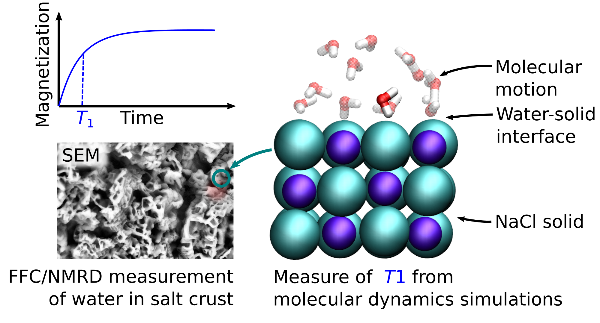

# NMR Investigation of Water in Salt Crusts: Insights from Experiments and Molecular Simulations

Langmuir 2023, XXXX, XXX, XXX-XXX

Authors: Simon Gravelle, Sabina Haber-Pohlmeier, Carlos Mattea, Siegfried Stapf, Christian Holm, and Alexander Schlaich
Publication Date: May 19, 2023

This repository is associated with [our publication](https://doi.org/10.1021/acs.langmuir.3c00036) in Langmuir.

  

## Data and script

Python and GROMACS scripts are hosted in the DaRUS repository of the university of Stuttgart: see here for [bulk systems](https://doi.org/10.18419/darus-3179), and here for [slit pores](https://doi.org/10.18419/darus-3180).

## Vulgarisation

