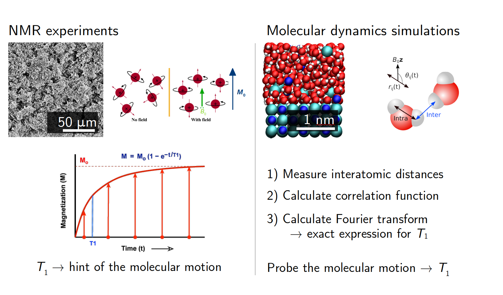
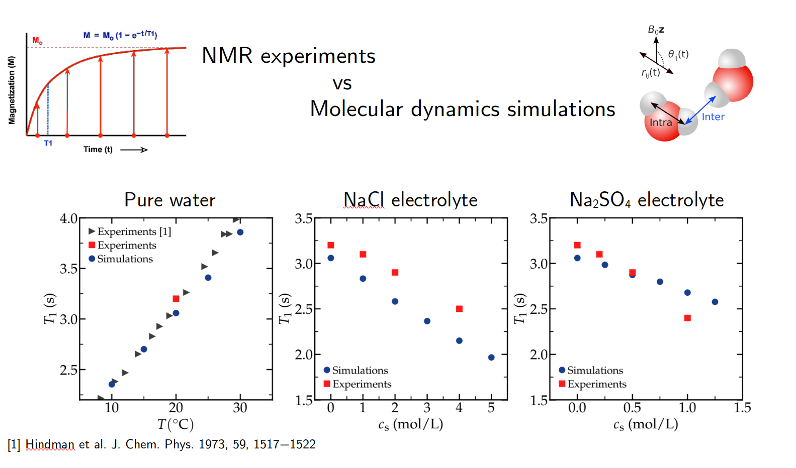
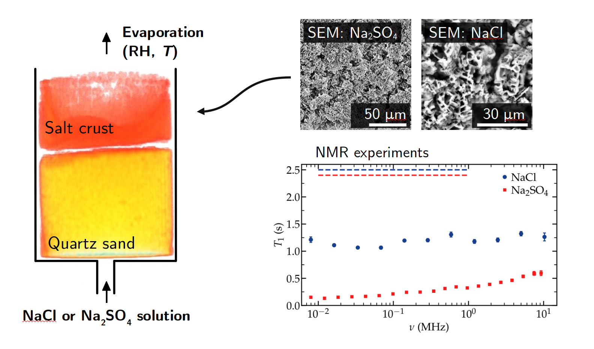

# NMR Investigation of Water in Salt Crusts:
# *Insights from Experiments and Molecular Simulations*

Langmuir 2023, XXXX, XXX, XXX-XXX

Authors: Simon Gravelle, Sabina Haber-Pohlmeier, Carlos Mattea, Siegfried Stapf, Christian Holm, and Alexander Schlaich
Publication Date: May 19, 2023

This [repository](https://github.com/simongravelle/gravelle2023langmuir) is associated with [our 2023 publication](https://doi.org/10.1021/acs.langmuir.3c00036) in Langmuir, in which we
investigate the properties of water confined withing salt crust using both NMR experiments and molecular dynamics simulations.

### Data and script

Python and GROMACS scripts are hosted in the DaRUS repository of the university of Stuttgart: see here for
[bulk systems](https://doi.org/10.18419/darus-3179), and here for [slit pores](https://doi.org/10.18419/darus-3180).

## A short overview of the goals and results

### Goals

This page describes the investigation we conducted as part of the [SFB 1313](https://www.sfb1313.uni-stuttgart.de/), in collaboration 
with the experimental group of Ilmenau (Germany). The goals of the investigation were to:

- **better understand the properties of water confined within salt crusts**, which are disordered porous media made of salt,
- **combine NMR experiments**, which allow for probing the dynamics of water within a porous medium, **with molecular simulations**, a numerical method which allow to resolve the trajectories of water molecules, and their interaction with the salt surface.

### Why studying salt crusts?

Salt crusts can form at the surface of soil due to evaporation. In some arid regions, soil salinization is a real problem, and one needs better understanding of the formation of salt crusts, and better prediction of the evaporation properties of water through the salt crusts.

### The particularity of solid salt surfaces

When a fluid is in contact with a solid surface, its properties near the solid surface are modified. In general, the fluid viscosity, density, or dielectric permeability are different within a few nanometer distance from the surface, due to the solid-liquid interactions.

In the case were the solid surface is made of salt, as is the case for porous salt crusts, it creates a systems that is really unique, because salt is present within the fluid, in the form of dissolved ions, and salt also constitutes the solid surface. In addition, the adsorption of ions at the solid surface creates rough and locally charged landscapes which in turn impact the properties of water within the interface layer, as we will see below.

### NMR experiments versus molecular dynamics simulations

Here, both NMR experiments and molecular dynamics (MD) simulations were conducted. Both methods can be used to measure the same quantities, the so-called NMR relaxation time, or *T1*, allowing in principle for direct comparison between the two methods. Here, however, the two systems of interest are of widely different scales (see Figure below), so direct comparisons are difficult. Instead, MD was used to model a small (single pore) portion of the crust, and to better understand the local interactions between the water and the salt.

In the case of the experiments, we used macroscopic salt crusts, which are porous medium made of salt and containing water. For the measurement of *T1*, the system is exposed to a large magnetic field, and the typical time the spins of the atoms, here the hydrogen atoms of the water molecules, need to align with the imposed magnetic field is measured. This characteristic time is called *T1*, and is typically of the order of a few seconds for liquid water at ambient temperature. The reason why *T1* is of interest here, is that it depends on the molecular motions of the water molecules within the salt crust, so measuring *T1* is a direct way of probing the rotational and translation motion of the molecules inside the pores. 

For the MD simulations, however, *T1* canno't be measured the same way (In MD, atoms are modelled as a simple point with a partial charge, but no spin). So instead of measuring *T1* directly, the opposite route is followed: the molecular motion is probed, and *T1* is calculated from it. Technically, one has to measure the distance and orientation between all the hydrogen atoms over time, inject those quantities in a correlation function, and then calculate its spectrum using Fourier transform. The equations are given in the [article](https://doi.org/10.1021/acs.langmuir.3c00036) and in the linked references, and the Python code we used for the calculation is available on Github, see [NMRforMD](https://github.com/simongravelle/nmrformd).

### Exact comparison in the case of bulk systems

For simple systems, like bulk solutions, comparison between experiments and simulations can be done directly *without* any adjustment parameters. For instance we did compare the value of *T1* for bulk water, and found a good agreement between our experiment, our MD simulations, and experiments from the literature (see figure below, left panel). Note however a slight difference between experimental and simulations, which could be due to the known discrepancy in viscosity between our water model (TIP4P/epsilon) and water.

We also compared experiments with simulations in the case of bulk NaCl and Na2SO4 electrolyte (see the previous figure, middle and right panels). The agreement is not perfect, which could be due to the fact that the force fields for the salt were calibrated in order to reproduce some thermodynamic properties of the salts (solvation energy and ionic activity), but *T1* also depends on dynamics properties like viscosity.   

### The experiment

In order to create salt crusts, wicking experiments were conducted. A solution of either sodium chloride (NaCl) or sodium sulfate (Na2SO4) was wicking through sand that was connected to an atmosphere of controlled relative humidity and temperature on the top, allowing for the evaporation of the water. After a few days, a salt crust was formed. SEM analysis conducted by Jenna Poonoosamy [IEK-6 Forschungszentrum Jülich, Germany] allowed us to characterize the pore size distribution, see the image bellow.

NMR experiments performed on the salt crusts revealed a lower value of *T1* in the case of Na2SO4, as compared to NaCl. This difference could be due to difference in pore size distribution, as smaller pores would have stronger impact on *T1* than larger pores. But it could also be due to difference in the interaction between the water and salt crust, as Na2SO4 and NaCl have different chemistry. This is why MD were performed.

### MD simulations: pure water in slit pore

First, MD simulations of *pure water* in a slit pore were performed using GROMACS, input scripts can be downloaded [here](https://doi.org/10.18419/darus-3180). The solid walls were made either of NaCl or Na2SO4 to match with the experiment, see the image bellow.

*T1* spectrum were extracted using [NMRforMD](https://github.com/simongravelle/nmrformd). The spectrum reveal a difference between the two salts, with *T1* at low frequency being lower in the case of Na2SO4. In the case of NaCl, strikingly, values of *T1* at low frequencies were almost equal to the bulk water values (dashed line), suggesting that NaCl slit walls have little to no impact on the properties of the confined water. This was a surprise to us.

If one splits the graph with respect to the frequency, one can identify 3 different areas. In Area I (see the previous figure), corresponding to low frequency, both spectrum are flat suggesting that there is no long (>100 ns) event that influence the spectrum, which is expected for confined systems. For such confined systems, the maximum times are typically governed by diffusion over the pore size, see [this article](https://pubs.acs.org/doi/10.1021/acs.nanolett.9b02858?ref=PDF). In Area III, at high frequency, the spectrum are governed by molecular motions (rotation and translation of the molecules), which typically occur over duration of 10-100 ps. The high frequency part of the spectrum is similar to what is observed for bulk systems. In Area 2, corresponding to intermediate regime, a variation of the spectrum is observed in the case of Na2SO4. This suggest that some additional mechanisms contribute to the relaxation. Here, those mechanism are clearly connected to what is occurring at the surface of pore, where the water molecules undergoes adsorption and desorption events over durations that are typically the nanosecond. These adsorption-desorption events obviously occur as well in the case of NaCl slit pores, but for some reason it does not appear in the spectra (the NaCl spectra is quasi-flat in Area II). Our hypothesis is that NaCl surfaces don't impact the water molecules enough, so there is no strong signature of the adsorption of the molecules at the surface, which will be confirmed below.

The effect of the solid surfaces on the fluid can be seen by looking at the density profile normal to the solid surface, where the solid surface is located in *z* = 0.
For both solid surface, a structuring of the liquid is visible over several water layer, with some strong oscillation in the density.

What is interesting is to have a look at the typical orientation of the water molecules next to the interface, which we do by introducing the parameter *S*, that is equal to 1 if the molecules are aligned with *z*, -0.5 if they are normal to *z*, and 0 if they are randomly oriented. The orientation profiles clearly show that water molecules are strongly polarized next to the solid surface of Na2SO4, and not so much in the case of NaCl, which could justify why the adsorption-desorption events of molecules entering and leaving the interface are visible only in the Na2SO4 spectra, not in the NaCl spectra.

### MD simulations: electrolyte in slit pore

So far, simulations were done using pure water as the fluid, but in a real salt crust, one expects the fluid to be an electrolyte with a relatively large concentration in ions. If we do the same simulations but increase the salt concentration progressively, it is clear that the spectra is impacted, particularly in the intermediate regime (Area II), and for both NaCl and Na2SO4:

It seems that adding salt to solution strongly impact the *T1* spectrum, and this is not just because the viscosity of the solution increases when the salt is added, otherwise, the changes would be visible at high frequency (Area III). Instead, changes are occurring at intermediate and low frequency, which suggests that this is an interface effect. In other words, adding salts reenforce the interaction between water and the salt surfaces, leading to lower values of *T1*.

The reason behind this effect can be understood by looking at the water-salt interface:

Ions adsorb at the solid walls, thus making the surface effectively rough. Since ions are charged, water molecules strongly polarize next to the adsorbed ions, leading to amplified NMR signature of the adsorption of the water molecule. In addition, in the case of the NaCl surface, more sodium ions adsorbed in comparison to chloride ions, which create a charged surface, and thus a charged liquid area  (i.e. filled with more counter-ions) next to the charged solid surface, which is also known to modify the properties of water more than a neutral walls.

### What to remember for this study

There are two main points that one can keep from this study:

- First, although NMR experiments and MD simulations can't be directly compared due to the differences in system size and complexity, *MD still provides meaningful information about the fluid-solid interface*, which in return helps in better understanding the experimental results.
- Second, *interfaces between water and salt surface are extremely complex* due to the continuum adsorption and desorption of the ions, which creates a particular landscape for the water molecules, increase the impact of the interface on the surface water, and by consequent impacts the NMR relaxation time. 

